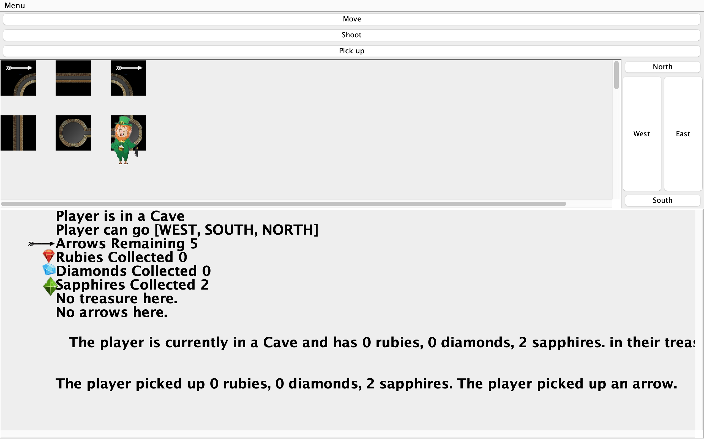

 # Project 5 
## _Graphical Adventure Game _

# About/Overview:
This is my implementation of the Graphical Adventure Game that builds upon our Dungeon Model and Text Based Adventure Game. A player enters the dungeon with nothing but their empty treasure sack, a bow, and 3 arrows in their quiver. The player then navigates the dungeon from their start point in search of their end point with the ability to pick up treasures and arrows as well as shoot those arrows in order to slay the monsters that await them in the dungeon. The player starts at a randomly selected point and  must navigate to a randomly selected end point at least 5 moves away. There will be at least one monster in the Dungeon at the end point but the user can ask for as many monsters as there are caves. There is also our thief Lucky the Leprechaun who will steal some treasure if you run into him. There is also a pit of death where a player will fall to their death if they step over the edge. You will get warnings about the pit when you hear rocks falling into the abyss and will see a red falling rocks sign. Dungeons are represented as interconnected nodes where row 0, column 0 also known as index 0 is in the top left-hand corner and the index increases from left to right in the increasing x direction of the Cartesian plane(columns). It then drops to the next y position down and all the way to the left like a carriage return to do the same process for the second row. The example 4 row by 3 columns graph is below: 

If re-enabled, the program will print the start cave, end cave, and final list of edges to the screen after it has generated which will have the indexes of both caves connected by a bidirectional arrow(18<========>23). This can help the player cheat if needed. 

# Features

- If the user passes 6 command line arguments [wrapping (boolean)] [# of rows (int)] [# of columns (int) ] [level of interconnectivity(int)] [percentage of treasure and arrows (int)] [level of difficulty/# of monsters(int greater than 0)] the game will enter the command line version. 

- Otherwise, if they enter no command line arguments then the game will kick off into a default dungeon in the graphical mode using a graphical user interface(GUI). 

- The user has no real interaction with any constructors. The controller passes all of those arguments, once validated at the first level, to the constructor. From there the dungeon and player are automatically built and run.

- One unique design feature is the treasure implementation which is an enum and factory pattern all in one class. This makes the code slightly more compact as a single stop for construction and validation of treasure. This allows the program to easily identify treasure objects in the players treasure list and cleanly present them when called.

- Caves and edges have a lot of detail which will help for expanding capability going forward. Caves and tunnels know who they are neighbors with as well as where they are in the dungeon. Edges contain the two caves associated with them. They also know which direction to travel to get from
one cave to the other. In the next implementation, this will be used so that the player takes a direction of travel rather than an index to move through the dungeon. Caves also have a treasure list in them that if selected by the treasure placement method stores the randomly generated treasure.

- The Dungeon implementation will let the user try and build the smallest possible graph by allowing them to build any graph with at least 6 nodes. It may not be able to construct it the first time and will throw an error if it cannot build a correct start and end point based on the randomly selected start point.

- The constructor for the dungeon will also check for over interconnectivity, ensuring there can't be more than 100% treasure in caves.

- As the player moves through the dungeon, they have the ability to pick up arrows and treasure at the same time if they are found together. Else they can pick up each set of items separately. 

- In the graphical version of the game, picking up is done by first selecting what the player wants to pick up. If they want to pick up arrows then they press "a" on their keyboard, else "t" for treasure or "b" for both. They then either press "p" or click the pickup button in the GUI. 

- In the text version of the game, the player can either spell out the behaviour they want or use the first letter. For example if the player wants to move east they can either type "move east" or they can type "m e". This applies to all behaviours include shoot, pickup or even quit. 

-In order to move in the graphical version of the game the player has to select a direction by either pressing 1 of the 4 arrows on their key board or clicking one of the directions on the gui in the panel on the right hand side. Those are labeled North, South, East and West. The player then must either press the "m" button on the keyboard or click the move button in the top panel of the GUI. 

- The player has the option to quit anytime they are prompted to move, shoot, or pickup by entering either quit or the letter q.

- The controller has the methods to both build the dungeon and play the game all in one. It implements the proper functionality to take in the command line arguments and pass them to the model for validation.

- With minor line changes, the program could be reconfigured to give more hints to the player as to where they are by adding situation updates providing the index of where the player is.

- The full print out of the final edges could also be included to help the player or other developers build features. It only takes one line change in the model to implement.

- I have included the jar file with the normal program as well as a seeded version for predictability. 

- I have added lucky the leprechaun who acts as my thief(bonus points). When the player runs into him the first time he will steal some, not all, of the player's treasure. He will then "dissapear never to be seen again". Lucky will still be there in the graphic version but the player will not be robbed again. 

- I have also added a pit of death(bonus points) and a graphical and textual warming. The player will know that their is a pit near by(within 1 space) by either getting the message that they hear rocks falling into the abyss and they will see a red warning sign appear on their cave. If the player moves into the pit space/falls in they die and the game ends immediatly. This can be identified graphically as a giant black space when the player steps in. 

# How To Run

## How to run the jar file
Move the jar file to the top level directory (same directory as source, res and test).

For the graphical version of the game, you run program by just entering java -jar Project5_Graphical_Adventure_Game.jar

For the text version enter the following substituting in your own boolean and integers: java -jar Project5_Graphical_Adventure_Game.jar [wrapping (boolean)] [# of rows (int)] [# of columns (int) ] [level of interconnectivity(int)] [percentage of treasure and arrows (int)] [level of difficulty/# of monsters(int greater than 0)]

The driver can be changed to use the controller to process arguments but that requires the build dugeon function to be called in the driver and the model passed off to the driver at that point. You would also have to wait or the controller to prompt the user for arguments or include the arguments on a separate line for the driver.

# How to Use the Program. 

Graphical Version: 
To move: 
1) first give a direction using either the keyboard arrows: up is north, down is south, left is west, right is east, or you can click one of the directional buttons in the window on the right hand side. 
2) either press the "m" key on the keyboard or use your mouse to click the move button in the top part of the window. 

To shoot: 
1) First give a direction using either the keyboard arrows: up is north, down is south, left is west, right is east, or you can click one of the directional buttons in the window on the right hand side. 
After the command line arguments are read in and the dungeon is constructed, the program will then drop the player in their starting cave telling them what the index is, what items if any are present in the cave, and which directions are available to them. The user will then be prompted to move, shoot, or pick up an item.
2) Give a distance between 0 and 9 by pressing one of the number keys on your keyboard. 
3) Press either the "s" key on your keyboard or click the shoot button in the top part of the window. 

To pick up: 
1) Select the type of item(s) you would like to pick up by either pressing the "a" key for arrows, the "t" key for treasure, or the "b" key for both. 
2) Press the "p" key to execute the pickup.

To restart the current dungeon:
1) Click the menu in the upper left-hand corner
2) Select "Restart Same Dungeon" from the menu.

To restart a dungeon with the same parameters:
1) Click the menu in the upper left-hand corner
2) Select "Restart New Dungeon"  from the menu.

To build a new dungeon with different parameters:
1) Click the menu in the upper left-hand corner
2) Select build new dungeon from the menu, this will generate a popup
3) Select either the wrapping or non-wrapping click box, enter the number of rows, columns, interconnectivity, treasure percentage, and difficulty.
4) Click the build button.

To quit: 
Either press the "q" key or
1) Click the menu in the upper left-hand corner
2) Select quit game from the menu

# Description of Examples/Example Runs

## Picture of Game running:
This is an example of my game running. In this picture you can see lucky the leprechaun as well as arrows and GUI.

# Design/Model Changes.

- I was able to simplify a lot of my code by passing whole objects instead .

- Lots of private methods were added to handle all the object passing and maintenance.

- I changed how I updated the players update location method by decoupling the pickup method allowing the player the choice to pick up or not.

- I also changed my random number generator to more consistently produce the same results by producing just single random numbers with the same seed across the entire program.

- Changed my player status messages and output to allow the player to figure out where they are. I keep the possible strings to make it easier if the customer needs more help to find their way. 

- With the graphical version of the game we now have caves, monsters, and other objects being presented graphically. 

- I changed/enhanced how I update the player status by building a custom data structure that gets all of the pertinent information and passes it to the view to present. Strings don't work cleanly because Jswing doesn't recognize carriage returns and therefor i needed a better way to present this. 

- I added the view by giving it a boardpanel where the dungeon displayed in the middle of the screen. I also added panel for giving the players status and pertinent information at the bottom. I then added action buttons at the top to execute the game actions of move, shoot, and pick up. Finally, I added a direction pad on the right hand side of the screen giving the user the ability to move by clicking one of the buttons the screen to move. 

# Assumptions

- A player will always want to pick up all treasure and doesn't have a limit to how much treasure they can carry. There is no point in not picking up all treasure in a cave. 

- The player does not care about any treasure or nodes in the cave that serves as the end point.

- A cave will only have 1 monster because they are solitary creatures. 

- A cave or tunnel will only have 1 arrow in it if it does have an arrow. This is to prevent the player from having tons of arrows and shooting them everywhere. The player will have to be strategic about how they use those arrows. 

# Limitations
- The player cannot pick up treasure or arrows in the final cave. The program will terminate because they have reached the end point. 

- In its current implementation, when a monster is killed some the caves will update their smell unless player revisits them. 

# Citations. 
Madhira Datta walked me through how to calculate the maximum number of edges in a graph for wrapping and non wrapping dungeons. I also found the method to condense my treasure enum and factory into one class and adapted that code from https://connected2know.com/programming/java-factory-pattern/. All citations have in line citations.